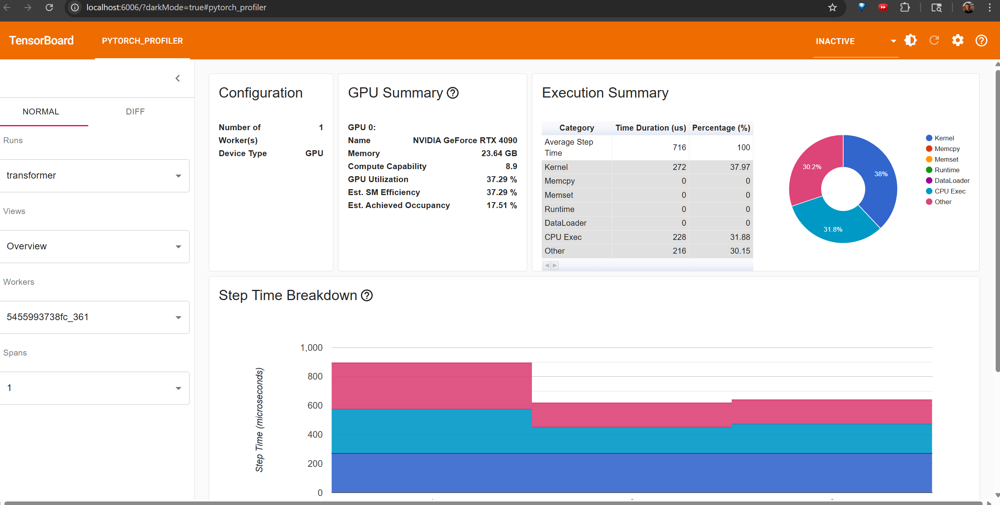
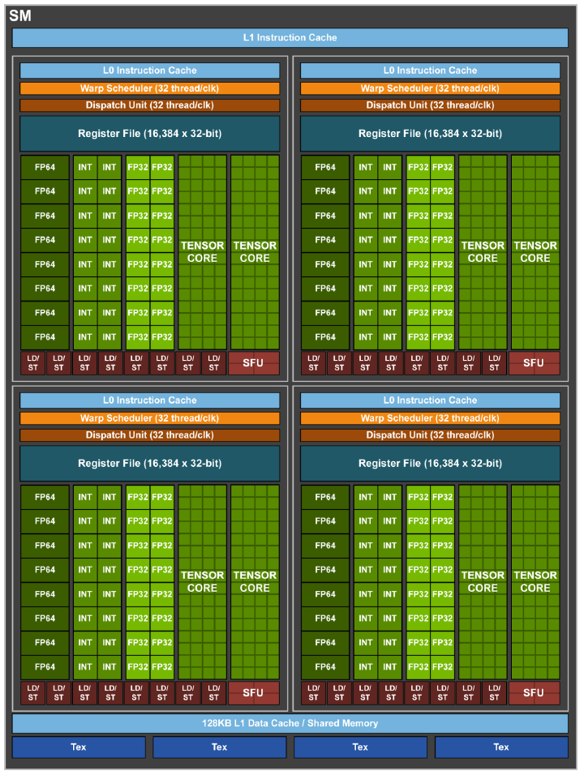
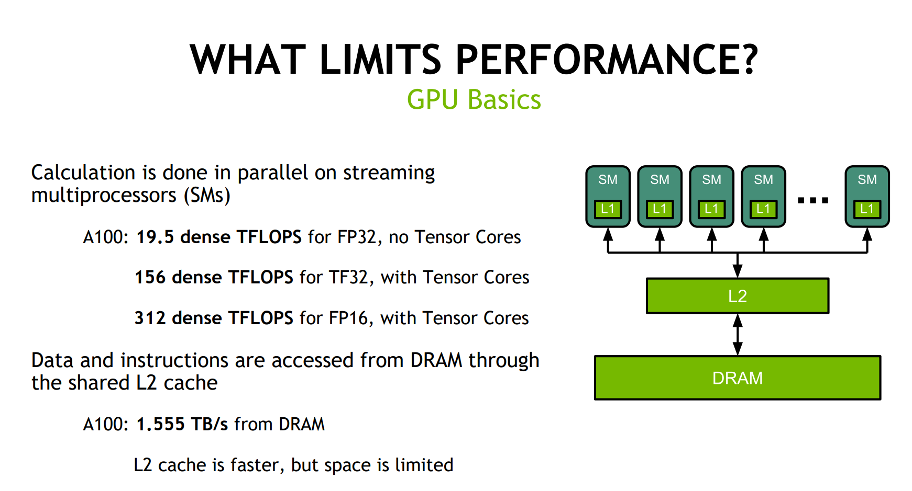
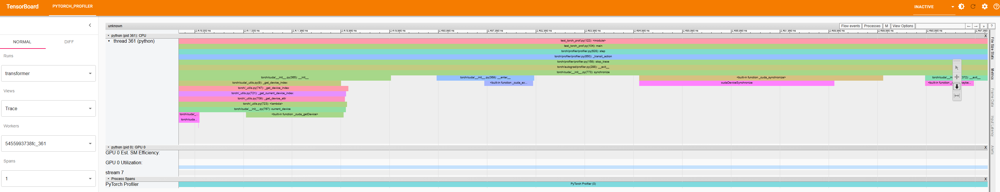
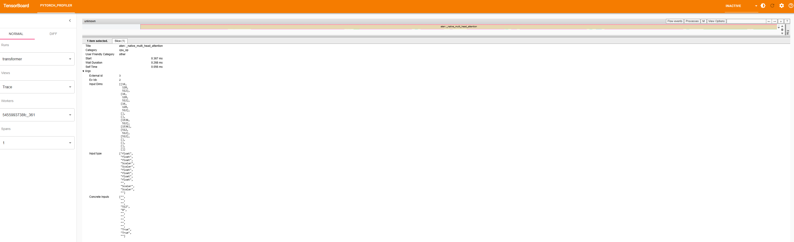
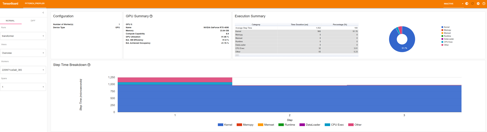
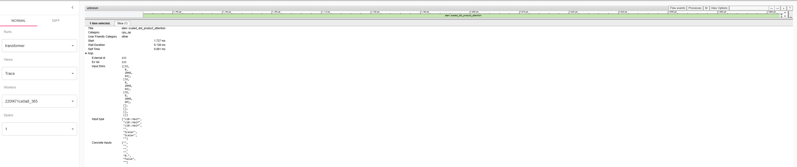

# How to Profile Models in PyTorch
By Quentin Anthony

## Table of Contents
* [PyTorch Profiler](#pytorch-profiler)
    * [Quickstart](#quickstart)
    * [GPU Efficiency](#gpu-efficiency)
    * [Reading Traces](#reading-traces)
    * [Baby's First Optimization](#babys-first-optimization)
* [Low-level GPU Profilers (coming soon)](#low-level-gpu-profilers)
    * [NVIDIA NSYS Profiler (coming soon)](#nvidia-nsys-profiler)
    * [AMD Rocprof Profiler (coming soon)](#amd-rocprof-profiler)

This tutorial seeks to teach users about using profiling tools such as nvsys, rocprof, and the torch profiler in a simple transformers training loop. We will cover how to use the PyTorch profiler to identify performance bottlenecks, understand GPU efficiency metrics, and perform initial optimizations.


## PyTorch Profiler

The torch profiler is my go-to tool to first become acclimated to a training loop. It gives a good summary of where time is being spent, and its shortcomings (e.g. lack of detail on hardware and kernel ops) can often be ignored on a first-pass of optimization. For low-level kernel optimization, we'll need the [GPU profilers](#gpu-profilers), but we can get to that later.


### Quickstart

I've provided a simple torch training loop for a vanilla transformer in [this script](torch_prof.py). Spin up a python environment with torch installed, and preferably on hardware with a GPU. I like the [torch NGC containers](https://docs.nvidia.com/deeplearning/frameworks/pytorch-release-notes/index.html) when using NVIDIA hardware:


```
git clone https://github.com/Quentin-Anthony/torch-profiler-tutorial.git
docker run --privileged --shm-size=1000gb --gpus all -it --rm -v ~/torch-profiler-tutorial:/torch-profiler-tutorial nvcr.io/nvidia/pytorch:23.10-py3
```

*Note:* Watch the file mount, and make sure to update that for your use case! 

<details>
<summary>What does this command mean?</summary>
<br>

- `docker run`: I'm spinning up a docker container from an image
- `--privileged`: This container is running in "privileged" mode, meaning I'm giving myself free reign over the system within my container, foregoing isolation protections.
- `--shm-size=1000gb`: I'm allocating 1TB of CPU RAM for my container, since I'm on a beefy system
- `--gpus all`: I'm letting the container access all GPUs on my system. Note that this requires the nvidia-docker runtime.
- `-it`: Opens a terminal for my interactive shell access within the container once it launches
- `-v <dirname-to-mount>:<mounted-dirname>`: Takes my dir `~/torch-profiler-tutorial` that lives outside the container and "mounts" it within the container
- `nvcr.io/nvidia/pytorch:23.10-py3`: Use the `pytorch` image with version `23.10-py3`. [See the full list of versions here](https://docs.nvidia.com/deeplearning/frameworks/pytorch-release-notes/index.html). 

</details>

Then I can just run the script:

```python3
python /torch-profiler-tutorial/torch_prof.py
```

which gives output:

```
<remote-machine>$ python torch_prof.py
Using device: cuda

Model and input tensor created. Starting profiler...
--------------------------------------------------
STAGE:2025-07-09 16:59:32 361:361 ActivityProfilerController.cpp:312] Completed Stage: Warm Up
STAGE:2025-07-09 16:59:32 361:361 ActivityProfilerController.cpp:318] Completed Stage: Collection
STAGE:2025-07-09 16:59:32 361:361 ActivityProfilerController.cpp:322] Completed Stage: Post Processing
STAGE:2025-07-09 16:59:32 361:361 ActivityProfilerController.cpp:312] Completed Stage: Warm Up
STAGE:2025-07-09 16:59:32 361:361 ActivityProfilerController.cpp:318] Completed Stage: Collection
STAGE:2025-07-09 16:59:32 361:361 ActivityProfilerController.cpp:322] Completed Stage: Post Processing
Profiler run complete. Printing summary...
--------------------------------------------------
-------------------------------------------------------  ------------  ------------  ------------  ------------  ------------  ------------  ------------  ------------  ------------  ------------  ------------  ------------  ------------  ------------  --------------------------------------------------------------------------------
                                                   Name    Self CPU %      Self CPU   CPU total %     CPU total  CPU time avg     Self CUDA   Self CUDA %    CUDA total  CUDA time avg       CPU Mem  Self CPU Mem      CUDA Mem  Self CUDA Mem    # of Calls                                                                      Input Shapes
-------------------------------------------------------  ------------  ------------  ------------  ------------  ------------  ------------  ------------  ------------  ------------  ------------  ------------  ------------  ------------  ------------  --------------------------------------------------------------------------------
                                          ProfilerStep*         8.62%     167.000us        99.79%       1.934ms     644.667us       0.000us         0.00%     817.000us     272.333us           0 b           0 b           0 b     -39.00 Mb             3                                                                                []
                                         Self-Attention         9.39%     182.000us        39.94%     774.000us     258.000us       0.000us         0.00%     355.000us     118.333us           0 b           0 b      15.00 Mb           0 b             3                                                                                []
                     aten::_native_multi_head_attention         3.97%      77.000us        30.55%     592.000us     197.333us       0.000us         0.00%     355.000us     118.333us           0 b          -8 b      15.00 Mb    -100.00 Mb             3  [[16, 128, 512], [16, 128, 512], [16, 128, 512], [], [], [1536, 512], [1536], [5
                                                    MLP         9.44%     183.000us        24.66%     478.000us     159.333us       0.000us         0.00%     411.000us     137.000us           0 b           0 b      12.00 Mb     -96.00 Mb             3                                                                                []
                                           Add & Norm 1         7.02%     136.000us        13.73%     266.000us      88.667us       0.000us         0.00%      24.000us       8.000us           0 b           0 b      12.00 Mb     -15.00 Mb             3                                                                                []
                                           Add & Norm 2         6.14%     119.000us        12.85%     249.000us      83.000us       0.000us         0.00%      27.000us       9.000us           0 b           0 b           0 b     -27.01 Mb             3                                                                                []
                                       cudaLaunchKernel        11.46%     222.000us        11.46%     222.000us       4.625us       0.000us         0.00%       0.000us       0.000us           0 b           0 b           0 b           0 b            48                                                                                []
                                       aten::layer_norm         0.77%      15.000us         8.36%     162.000us      27.000us       0.000us         0.00%      33.000us       5.500us           0 b           0 b      24.01 Mb     -88.00 Kb             6                                        [[16, 128, 512], [], [512], [512], [], []]
                                aten::native_layer_norm         4.02%      78.000us         7.59%     147.000us      24.500us      33.000us         4.04%      33.000us       5.500us           0 b           0 b      24.09 Mb           0 b             6                                            [[16, 128, 512], [], [512], [512], []]
                                           aten::linear         0.77%      15.000us         6.40%     124.000us      41.333us       0.000us         0.00%     189.000us      63.000us           0 b           0 b      48.00 Mb           0 b             3                                             [[16, 128, 512], [2048, 512], [2048]]
                                           aten::linear         0.83%      16.000us         6.30%     122.000us      40.667us       0.000us         0.00%     195.000us      65.000us           0 b           0 b      12.00 Mb           0 b             3                                             [[16, 128, 2048], [512, 2048], [512]]
                                              aten::add         3.25%      63.000us         5.06%      98.000us      16.333us      18.000us         2.20%      18.000us       3.000us           0 b           0 b      30.00 Mb      30.00 Mb             6                                              [[16, 128, 512], [16, 128, 512], []]
                                            aten::addmm         2.94%      57.000us         4.85%      94.000us      31.333us     195.000us        23.87%     195.000us      65.000us           0 b           0 b      12.00 Mb       9.00 Mb             3                                        [[512], [2048, 2048], [2048, 512], [], []]
                                            aten::addmm         3.25%      63.000us         4.80%      93.000us      31.000us     189.000us        23.13%     189.000us      63.000us           0 b           0 b      48.00 Mb      45.00 Mb             3                                        [[2048], [2048, 512], [512, 2048], [], []]
                                            aten::empty         4.49%      87.000us         4.49%      87.000us       2.636us       0.000us         0.00%       0.000us       0.000us           0 b           0 b      84.09 Mb      84.09 Mb            33                                                          [[], [], [], [], [], []]
-------------------------------------------------------  ------------  ------------  ------------  ------------  ------------  ------------  ------------  ------------  ------------  ------------  ------------  ------------  ------------  ------------  --------------------------------------------------------------------------------
Self CPU time total: 1.938ms
Self CUDA time total: 817.000us


--------------------------------------------------
To view the detailed trace, run the following command in your terminal:
tensorboard --logdir=./log
--------------------------------------------------
```

I now have a log directory at `./log` with the following contents:

```
$ tree log
log
└── transformer
    ├── 5455993738fc_361.1752080372327428368.pt.trace.json
    └── 5455993738fc_361.1752080372344681618.pt.trace.json

1 directory, 2 files
```

Now I *could* run tensorboard within my container and port-forward it to my local machine, but opening a port in a privileged docker container can be insecure. It's probably not the "right" way to do things, but I just `scp -r` the `./log` dir to my local machine, which is running a conda env tensorboard. In any case, you need to either get the forwarded port of the tensorboard server *or* the logs themselves onto a local machine, then open that profile.

So for me on my local machine:

```
pip install torch_tb_profiler
scp -r <remote-machine>:/path/to/log/ ./torch-profs/
tensorboard --logdir=./torch-profs/log
```

(I'll note here that the tensorboard trace viewer is RAM-hungry and may not display if your trace is big. If you fall into that bucket, you can use other trace viewers like https://ui.perfetto.dev/, but it's less feature-rich than the torch profiler. You can reduce the size of your trace by reducing the number of profiling iters or the global batch size. If that fails, you could also turn off `with_stack=True` or reduce the number of layers in your model.)

Which then lets me navigate to `http://localhost:6006/` (or wherever I tell tensorboard, if I choose to) on my favorite web browser and see:

<div align="center">
    
</div>

Some notes:
1. "Execution Summary": I can now immediately see where my iter time is being spent. There are very high proportions of "CPU Exec" and "Memcpy", so the GPU is sitting idle for the majority of each iter!
2. "GPU Summary": The poor GPU util can also be seen via the low GPU utilization and SM efficiency
3. "Step Time Breakdown" We profile for 3 steps. All three have the same kernel time, but the first has much higher CPU and Memcpy time. Looks like initial setup (e.g. moving the model from CPU to GPU) is taking some time.


And now for a painstakingly detailed look at measuring GPU efficiency:

### GPU Efficiency

The first 3 items are self-explanatory. I'm running on a single 4090 NVIDIA GPU with ~23.6 GB of VRAM. Its classified within the 8.9 set of NVIDIA GPU hardware (see [https://docs.nvidia.com/cuda/cuda-c-programming-guide/index.html#compute-capabilities](this) to get a more complete list of hardware features that lie within each compute capability, and [here](https://developer.nvidia.com/cuda-gpus) for a full mapping of GPUs to compute capabilities.)


The documentation for how the torch profiler calculates these metrics is at https://github.com/pytorch/kineto/blob/16e2a56ba1b65412ea774d183b577d3fc2734501/tb_plugin/docs/gpu_utilization.md. I give some further explanations below targeted to practitioners:

The remaining metrics seek to answer the question "how busy was my GPU"? You'll find that the answer to this question is a bit nuanced (see [this](https://developer.download.nvidia.com/GTC/PDF/GTC2012/PresentationPDF/S0514-GTC2012-GPU-Performance-Analysis.pdf) excellent resource), and there are layers to determining how busy your GPU is:
1. The **GPU Utilization** is the proportion of the total profiling time that the GPU was running at least one kernel. This is the same metric reported under GPU-Util whenever you run `nvidia-smi`. This is the first metric that we seek to maximize (the GPU should be running *something* at all times), but it's not enough to just maximize util (e.g. what if we just fill a single [streaming multiprocessor (SM)](https://modal.com/gpu-glossary/device-hardware/streaming-multiprocessor) for the full time? Util will be 100%, but most of our GPU is unused!). 100% GPU Utilization is a necessary, but not sufficient, condition for good training throughput.
2. The **Est. SM Efficiency** shows the number of SMs that kernels used on average. Specifically, it's a weighted sum of the number of thread blocks that each kernel deployed to the GPU (the weight is kernel duration). So while GPU Util tells us how busy our GPU is at the granularity of SMs, the SM Efficiency tells us how busy our GPU is at the granularity within SMs. Note that this still isn't enough to tell the whole story! We could be running many thread blocks with only a single thread per block, which will leave many of the CUDA/Tensor cores idle within each SM. What do these values being equal tell us about the workload we're running? (think about the answer on your own first for a second!!!). It tells us that whenever a kernel is *actually* running on the GPU, every single SM has at least one thread block running on it. So the kernels themselves are doing a good job of splitting across the SM dimension (but not necessarily filling those SMs, as a note).
3. The **Est. Achieved Occupancy** tells us the ratio of active warps that kernels are running on an SM to the maximum number of active warps supported by the SM, again weighted by the kernel runtime. See [this](https://docs.nvidia.com/gameworks/content/developertools/desktop/analysis/report/cudaexperiments/kernellevel/achievedoccupancy.htm) for some more detail on the definition. I'll also note that it can be confusing for beginners to differentiate threads, thread blocks, and warps (e.g. what does a thread block with a single thread look like when mapped to warps?), so I suggest reading [this SO answer](https://stackoverflow.com/questions/16635587/whats-the-difference-between-a-thread-in-a-block-and-a-warp32-threads). Our achieved occupancy is pretty low, which means that each block carries few warps. This is likely because we're doing a forward pass of a small transformer with a small batch size and sequence length, so many tiny matmuls are being issued as a bunch of blocks across SMs, each with only a couple of warps. We have low warp occupancy.

GPUs are parallelism machines within parallelism machines. A GPU is composed of many SMs (e.g. 144 on H100), each of which is composed of many tensor cores and CUDA cores. Tensor cores are much faster than CUDA cores at matrix multiplications (by ~8x. See [Tensor Core Speedups](#tensor-core-speedups)), so we seek to fill these tensor cores with as much useful work as possible per timestep.

**GPU Diagram**             |  **V100 SM Diagram**
:-------------------------:|:-------------------------:
  |  


#### Footnote: My Own Opinionated Take on Measuring Throughput

These details are why I push people to dig deeper when asking the question "is my training throughput good?". I like to frame this as maximizing "goodput", which I'd define as "how many cores are busy, and how many of them are doing work that directly drives the computation forward". While determining the number of busy cores is a tractable problem for automatic profilers (albeit a complex one, see above), the second is harder to define. What if I fill all the idle cores with useless work? My raw throughput is increased, but my goodput is not. Writing efficient kernels is not just about blindly maximizing the occupancy metrics, it's about using those metrics to find ways to train your model faster. This is why many of the "can LLMs write kernels" studies are fundamentally flawed. LLMs are good at finding loopholes to maximize KPIs via silly kernels that are useless in practice. See [this](https://x.com/main_horse/status/1892408991327932883) and [this](https://x.com/cHHillee/status/1941180893844078605) for examples. I don't say this to claim my expertise can't be automated by an LLM, but rather to push those writing benchmarks and evals to very deeply understand the metrics of success for whatever they're evaluating an LLM on, and making the KPIs as immune to being gamed like this as possible by a clever but lazy LLM under test. 


#### Footnote: Tensor Core Speedups

<div align="center">
    
</div>

I (and nvidia) claim that fp16/bf16 matrix multiplications on tensor cores tend to give 13x-16x speedup over fp32 matrix multiplications on cuda cores.

From [this](https://developer.download.nvidia.com/video/gputechconf/gtc/2020/presentations/s21929-tensor-core-performance-on-nvidia-gpus-the-ultimate-guide.pdf), slide 7. The reasoning here is that while there are fewer TCs than cuda cores (CCs) [e.g. 640 TCs and 5120 CCs on a V100], each TC can do far more fused multiply-accumulates (FMAs) necessary for GEMMs in a single clock cycle than a CC [e.g. 64 FMAs per cycle for TCs and 1 FMA per cycle for CCs on V100s]. So for a unified dtype like fp16, we expect:

(TC FMAs / CC FMAs) * (#TCs / #CCs)  =  (64 / 1) * (640 / 5120) = 8x speedup.

As a sidenote, future nvidia gpus like A100 and H100 didn't significantly increase the number of TCs, but rather the FMAs per TC.

The extra 2x to get us to a 16x speedup is from doing the multiplies (but not accumulates!) in lower precisions. NVIDIA is cagey about how they do lower-precision FMAs on the same tensor cores (or maybe I just don't know where to look), but my mental model is that they do something like register-packing of two smaller buffers in the same register. In any case, fitting twice the amount of GEMM elements on the same registers translates to a linear speedup, which gets us to 16x for fp32 --> fp16/bf16 and 32x for fp32 --> fp8.

Finally, the 13x I use in my head for fp32 --> bf16/fp16 is accounting for overhead fudge factors. Even in an ideal fused kernel with some overlap on the data movement, we're gonna lose time to synchronization, non-overlapped data movement, etc. We can only speed up the time spent in tensor cores. 


### Reading Traces

Let's pan to an attention operation and look at it in some more detail.

<div align="center">
    
</div>

A few things here:
1. The CPU thread view is in the top row (thread 361), and our GPU is below (pid 0). That GPU has a single CUDA stream, with convenient time-matched readouts of the Est. SM Efficiency and GPU Utilization. This allows us to check how well each kernel saturates SMs.
2. All of the kernel ops are issued on stream 7, but their namings are a bit opaque. What in our model is launching `cutlass::Kernel<cutlass_80_tensorop_s1688gemm_128x128_16x5_tn_align4>(cutlass_80_tensorop_s1688gemm_128x128_16x5_tn_align4::Params)`? All we have on the CPU side are a bunch of `cudaLaunchKernel` ops, but which kernel? We can get each kernel's associated kernel launch by first selecting the kernel in question on stream 7, and then clicking the **Incoming Flow** event's **Link**. This shows us an arrow to the first `aten:mm` within the `nn.MultiheadAttention`. I'll note that we can find this flow in the opposite direction by selecting a `cudaLaunchKernel` and selecting **Outgoing Flow**. 
3. Note the callstack in the CPU row. We can see that all of these ops are within the "Self-Attention" label from our SimpleTransformerLayer.forward(), which is just a call to `nn.MultiheadAttention`. 

While these GPU kernels are optimized GEMMs from cutlass, they're not an I/O aware implementation like Tri Dao's flash attention or cuDNN's fused attention!

#### Synchronization

You may encounter long synchronization points on the CPU. For example:

<div align="center">
    
</div>

This doesn't necessarily mean it's taking the CPU a long time to run the sync operation itself, but rather that our code has explicitly or implictly used an operation that requires that the GPU sync to the CPU, and the CPU is waiting for the GPU to reach that point. Any good implementation will likely involve a lot of CPU/GPU overlap, so these sync points can make mapping the CPU's activity to the GPU's more difficult (after all, the point of doing torch profiling is often to map my torch code to their underlying GPU effects). Indeed, all of the CPU trace view is just measuring kernel launch overheads, which can fool beginners into thinking they have a bunch of short and efficient ops followed by a small, innocuous op that incurred a sync. To force the CPU to wait for every issued kernel to complete before continuing, you need to launch with the `CUDA_LAUNCH_BLOCKING=1` environment variable. Note that this destroys overlap and overestimates runtime, but this boils down to a tradeoff between "profile interpretability" and "how well the profile's behavior matches my expected training run". Use your best judgement on which to use and when, but interpretability tends to win when we're profiling!


### Baby's First Optimization

From the above, there are some very clear low-hanging fruits that we can improve:
1. The batch size and sequence length are too small, and SMs are not full despite the fact that each kernel issues thread blocks to all SMs in the GPU.
2. We aren't using a fused flash attention implementation, leading to many smaller GEMMs and their associated data movement between them.
3. You have to be especially eagle-eyed, but these kernels are actually being run in TF32 instead of BFLOAT16/FLOAT16! This is evidenced by the input types if I look at each aten op (see below). Easy to miss!

<div align="center">
    
</div>


Because we ran the torch profiler with `with_stack=True`, we get the full call trace of all the CPU ops. This is enormously helpful for libraries with lots of abstraction like Megatron or HuggingFace Transformers. 

I've made the following optimizations in `torch_prof_optim.py` (see the new `OPTIM` lines for yourself!):
1. Turned on the flash attention backend via `need_weights=False` and `torch.backends.cuda.enable_flash_sdp(True)`. This should fuse many of our attention kernels together, leading to less idleing during data movement.
2. I greatly increased the problem size by running with `batch_size=32` and `seq_length=2048`. Note that this will lead to a significantly larger number of tokens that we're seeing in 10 iters and therefore a higher end-to-end runtime. This should fill SMs much better.
3. I used autocast to perform most ops in fp16, and just keep some sensitive ops like layernorm in fp32. This should half our data movement cost and significantly improve our compute speed (see [Footnote: Tensor Core Speedups](#footnote-tensor-core-speedups)).


Then I can just run the script:

```
python torch_prof_optim.py
```

which gives output:

```
$ python torch_prof_optim.py
Using device: cuda

Model and input tensor created. Starting profiler...
--------------------------------------------------
STAGE:2025-07-09 22:51:57 365:365 ActivityProfilerController.cpp:312] Completed Stage: Warm Up
STAGE:2025-07-09 22:51:57 365:365 ActivityProfilerController.cpp:318] Completed Stage: Collection
STAGE:2025-07-09 22:51:57 365:365 ActivityProfilerController.cpp:322] Completed Stage: Post Processing
STAGE:2025-07-09 22:51:57 365:365 ActivityProfilerController.cpp:312] Completed Stage: Warm Up
STAGE:2025-07-09 22:51:57 365:365 ActivityProfilerController.cpp:318] Completed Stage: Collection
STAGE:2025-07-09 22:51:57 365:365 ActivityProfilerController.cpp:322] Completed Stage: Post Processing
Profiler run complete. Printing summary...
--------------------------------------------------
-------------------------------------------------------  ------------  ------------  ------------  ------------  ------------  ------------  ------------  ------------  ------------  ------------  ------------  ------------  ------------  ------------  --------------------------------------------------------------------------------
                                                   Name    Self CPU %      Self CPU   CPU total %     CPU total  CPU time avg     Self CUDA   Self CUDA %    CUDA total  CUDA time avg       CPU Mem  Self CPU Mem      CUDA Mem  Self CUDA Mem    # of Calls                                                                      Input Shapes
-------------------------------------------------------  ------------  ------------  ------------  ------------  ------------  ------------  ------------  ------------  ------------  ------------  ------------  ------------  ------------  ------------  --------------------------------------------------------------------------------
                                  cudaDeviceSynchronize        93.63%      42.497ms        93.63%      42.497ms      42.497ms       0.000us         0.00%       0.000us       0.000us           0 b           0 b           0 b           0 b             1                                                                                []
                                          ProfilerStep*         0.52%     237.000us         6.37%       2.893ms     964.333us       0.000us         0.00%      28.515ms       9.505ms           0 b           0 b           0 b    -768.00 Mb             3                                                                                []
                                         Self-Attention         0.86%     392.000us         2.99%       1.355ms     451.667us       0.000us         0.00%      16.896ms       5.632ms           0 b           0 b     192.00 Mb      -1.69 Gb             3                                                                                []
                                                    MLP         0.39%     175.000us         1.19%     538.000us     179.333us       0.000us         0.00%       7.612ms       2.537ms           0 b           0 b     192.00 Mb      -1.56 Gb             3                                                                                []
                                       aten::layer_norm        -0.10%     -45.000us         1.17%     533.000us      44.417us       0.000us         0.00%       4.098ms     341.500us           0 b           0 b       1.50 Gb    -515.03 Mb            12                                       [[32, 2048, 512], [], [512], [512], [], []]
                     aten::scaled_dot_product_attention         0.05%      24.000us         0.94%     427.000us     142.333us       0.000us         0.00%      10.659ms       3.553ms           0 b         -48 b     192.00 Mb      -6.00 Mb             3         [[32, 8, 2048, 64], [32, 8, 2048, 64], [32, 8, 2048, 64], [], [], [], []]
                                           Add & Norm 1         0.31%     141.000us         0.92%     418.000us     139.333us       0.000us         0.00%       2.140ms     713.333us           0 b           0 b     384.00 Mb    -192.00 Mb             3                                                                                []
              aten::_scaled_dot_product_flash_attention         0.09%      39.000us         0.89%     403.000us     134.333us       0.000us         0.00%      10.659ms       3.553ms          48 b           0 b     198.00 Mb    -576.00 Mb             3         [[32, 8, 2048, 64], [32, 8, 2048, 64], [32, 8, 2048, 64], [], [], [], []]
                                       cudaLaunchKernel         0.78%     354.000us         0.78%     354.000us       4.720us       0.000us         0.00%       0.000us       0.000us           0 b           0 b           0 b           0 b            75                                                                                []
                                           Add & Norm 2         0.27%     123.000us         0.76%     345.000us     115.000us       0.000us         0.00%       1.867ms     622.333us           0 b           0 b           0 b    -768.00 Mb             3                                                                                []
                                           aten::linear         0.05%      24.000us         0.72%     329.000us      54.833us       0.000us         0.00%       6.036ms       1.006ms           0 b           0 b       1.56 Gb     -64.00 Mb             6                                            [[32, 2048, 512], [2048, 512], [2048]]
                                           aten::linear         0.04%      16.000us         0.47%     214.000us      71.333us       0.000us         0.00%       3.834ms       1.278ms           0 b           0 b     576.00 Mb           0 b             3                                            [[2048, 32, 512], [1536, 512], [1536]]
                                               aten::to         0.19%      85.000us         0.40%     182.000us      15.167us       0.000us         0.00%      12.000us       1.000us           0 b           0 b      24.00 Kb      12.00 Kb            12                                                           [[512], [], [], [], []]
                                            aten::empty         0.39%     177.000us         0.39%     177.000us       2.682us       0.000us         0.00%       0.000us       0.000us          32 b          32 b       2.64 Gb       2.64 Gb            66                                                          [[], [], [], [], [], []]
                                         aten::_to_copy         0.07%      33.000us         0.39%     177.000us      14.750us       0.000us         0.00%      24.000us       2.000us           0 b           0 b      24.00 Kb           0 b            12                                                   [[512], [], [], [], [], [], []]
-------------------------------------------------------  ------------  ------------  ------------  ------------  ------------  ------------  ------------  ------------  ------------  ------------  ------------  ------------  ------------  ------------  --------------------------------------------------------------------------------
Self CPU time total: 45.390ms
Self CUDA time total: 38.012ms


--------------------------------------------------
To view the detailed trace, run the following command in your terminal:
tensorboard --logdir=./log
--------------------------------------------------
```

Now let's load this profile up and take a look!


<div align="center">
    
</div>

GPU util, SM efficiency, and Achieved occupancy are all greatly improved. Most of our time is now spent in kernels, instead of sitting around waiting for the CPU to keep up. I'll note that the first iter still takes some more time to set things up on CPU.

Now let's look at the new trace:

<div align="center">
    
</div>

Recall what I spoke about with `CUDA_LAUNCH_BLOCKING=1` in [Synchronization](#synchronization)? Looks like our CPU is able to keep launching kernels faster than the GPU can churn through them, since CPU is no longer the bottleneck. 

Attention is now calling `scaled_dot_product_attention`, which uses fused multi-head attention (FMHA) kernels like `pytorch_fmha::fmha_fwd_loop_kernel<FMHA_kernel_traits<256, 64, 16, 1, 4, 8u, __half>, false, false, false>` instead of the every component GEMM like before. GEMMs are also now in fp16 instead of tf32, such as this MLP GEMM: `ampere_fp16_s1688gemm_fp16_64x128_sliced1x2_ldg8_relu_f2f_tn`. Doing all of our forward and backward compute in lower precisions like fp16/bf16 allows us to push twice as much data through our GPU (The 4090 GPU can perform at most 82.6 TF32 TFLOPS on tensor cores, and 165.2 BF16/FP16 TFLOPs on tensor cores. Recall that TF32 is NVIDIA's datatype that allows FP32 data to use tensor cores. See [Tensor Core Speedups](#footnote-tensor-core-speedups)). We can verify that by looking at the aten input types (see below). Great!

<div align="center">
    
</div>


You now have the major tools needed to take and analyze profiles. As always, get your hands dirty asap and traverse the knowledge tree depth-first. Open an issue if I missed anything. Have fun!


## Low-level GPU Profilers

### NVIDIA NSYS Profiler
TODO


### AMD Rocprof Profiler
TODO
